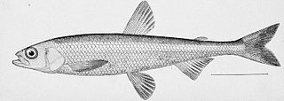

<!-- README.md is generated from README.Rmd. Please edit that file -->

```{r, include = FALSE}
knitr::opts_chunk$set(
  collapse = TRUE,
  comment = "#>",
  fig.path = "man/figures/README-",
  out.width = "100%"
)
```

# smeltr <a href="https://commons.wikimedia.org/wiki/File:Pond_smelt_illustration.jpg"></a>


<!-- badges: start -->
<!-- badges: end -->

Read through amateurish spreadsheets and figure out how to tidy them.

## Installation

You can install the development version of smeltr from [GitHub](https://github.com/) with:

``` r
# install.packages("devtools")
devtools::install_github("higherX4Racine/smeltr")
```

## Example

This is a basic example which shows you how to solve a common problem:

```{r}
#| label: example
library(smeltr)
## basic example code
dummy()
```
