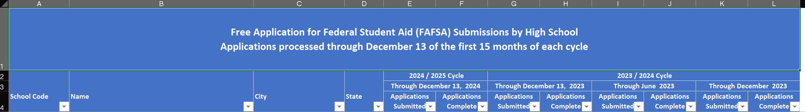

<!-- README.md is generated from README.Rmd. Please edit that file -->

```{r, include = FALSE}
knitr::opts_chunk$set(
  collapse = TRUE,
  comment = "#>",
  fig.path = "man/figures/README-",
  out.width = "100%"
)
```

# smeltr <a href="https://commons.wikimedia.org/wiki/File:Pond_smelt_illustration.jpg"></a>


<!-- badges: start -->
<!-- badges: end -->

Read through amateurish spreadsheets and figure out how to tidy them.

## Installation

You can install the development version of smeltr from [GitHub](https://github.com/) with:

``` r
# install.packages("devtools")
devtools::install_github("higherX4Racine/smeltr")
```

## Example

Many spreadsheets come with nested headings and wide, rather than tidy, layouts.
For example, the Federal government makes monthly reports about
[FAFSA® Completion by High School and Public School District](https://studentaid.gov/data-center/student/application-volume/fafsa-completion-high-school).
These spreadsheets have many complicated rows of headers, as you can see below.



```{r}
#| label: extract-wyoming-fafsa-headers

"extdata" |>
    system.file("WY.xls",
                package = "smeltr") |>
    smeltr::extract_headers_from_sheet(.sheet = "WY School Level Data",
                                       .nrows = 4) |>
    dplyr::select(-2) |>
    dplyr::mutate(
        dplyr::across(tidyselect::starts_with("Row"),
                      \(.)stringr::str_replace_all(., "\\n", "; "))
    ) |>
    tidyr::fill(tidyselect::starts_with("Row"), .direction = "down") |>
    knitr::kable()
```

