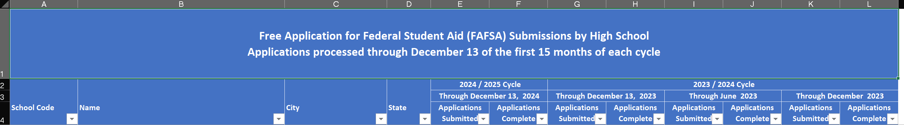

<!-- README.md is generated from README.Rmd. Please edit that file -->

# smeltr <a href="https://commons.wikimedia.org/wiki/File:Pond_smelt_illustration.jpg"></a>

<!-- badges: start -->
<!-- badges: end -->

Build algorithms for tidying spreadsheets with complicated layouts.

## Installation

You can install the development version of smeltr from
[GitHub](https://github.com/) with:

``` r
# install.packages("devtools")
devtools::install_github("higherX4Racine/smeltr")
```

## Example

Many spreadsheets come with nested headings and wide, rather than tidy,
layouts. For example, the Federal government makes monthly reports about
[FAFSA® Completion by High School and Public School
District](https://studentaid.gov/data-center/student/application-volume/fafsa-completion-high-school).
These spreadsheets have many complicated rows of headers, as you can see
below.

<figure>

<figcaption aria-hidden="true">The top rows of a Federal spreadsheet
about FAFSA completion in WY</figcaption>
</figure>

``` r
"extdata" |>
    system.file("WY.xls",
                package = "smeltr") |>
    smeltr::extract_headers_from_sheet(.sheet = "WY School Level Data",
                                       .nrows = 4) |>
    dplyr::select(-2) |>
    dplyr::mutate(
        dplyr::across(tidyselect::starts_with("Row"),
                      \(.)stringr::str_replace_all(., "\\n", "; "))
    ) |>
    tidyr::fill(tidyselect::starts_with("Row"), .direction = "down") |>
    knitr::kable()
```

| Column | Row2 | Row3 | Row4 |
|---:|:---|:---|:---|
| 1 | NA | NA | School Code |
| 2 | NA | NA | Name |
| 3 | NA | NA | City |
| 4 | NA | NA | State |
| 5 | 2024 / 2025 Cycle | Through December 13, 2024 | Applications; Submitted; Dec13 2024 |
| 6 | 2024 / 2025 Cycle | Through December 13, 2024 | Applications; Complete; Dec13 2024 |
| 7 | 2023 / 2024 Cycle | Through December 13, 2023 | Applications; Submitted; Dec13 2023 |
| 8 | 2023 / 2024 Cycle | Through December 13, 2023 | Applications; Complete; Dec13 2023 |
| 9 | 2023 / 2024 Cycle | Through June 2023 | Applications; Submitted; Jun 2023 |
| 10 | 2023 / 2024 Cycle | Through June 2023 | Applications; Complete; Jun 2023 |
| 11 | 2023 / 2024 Cycle | Through December 2023 | Applications; Submitted; Dec 2023 |
| 12 | 2023 / 2024 Cycle | Through December 2023 | Applications; Complete; Dec 2023 |
